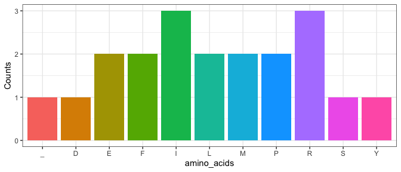

<!-- README.md is generated from README.Rmd. Please edit that file -->

# CentralDogma package

## Installation

You can install the development version of CentralDogma from
[GitHub](https://github.com/) with:

``` r
# install.packages("pak")
pak::pak("rforbiodatascience24/group_03_package")
```

### Group members:

s225049: Ida Sofie Goldschmidt  
s225074: Annekatrine Kirketerp-Møller  
s225051: Emil August Dissing Berntsen  
s224974: Rasmus Kamp  
s215109: Rolf Larsen

### Loading the library

``` r
library(CentralDogma)
```

### Description and demonstration

**sample_nuc**  
*sample_nuc* takes an integer as input and outputs a string. The output
string is a DNA sequence, which is a character-string only using “A”,
“C”, “T” and “G” representing each of the nucleotides in DNA. The length
of the string is based on the input integer.

``` r
set.seed(6)
dna <- sample_nuc(60)
dna
#> [1] "ATATCCCGATTTTTGGACATGATGTATCCCGAGCCTATTAGAATAGAGCGTTAGCTGTTT"
```

**find_stop_start**  
\*\*The *find_stop_start* function takes on a string of amino acids and
finds possible start and stop codons index positions in that string.

``` r
codon_index <- find_stop_start(dna)
print(codon_index)
#> $start_codons
#> [1] 19 22
#> 
#> $stop_codons
#> [1] 20 39 44 52
```

**translate_DNA**  
*translate_DNA* takes a DNA string as input and outputs the
corresponding RNA string. The input string is translated by replacing
every “T” with a “U”. The input could for example come from the output
from *sample_nuc()*.

``` r
rna <- translate_DNA(dna)
rna
#> [1] "AUAUCCCGAUUUUUGGACAUGAUGUAUCCCGAGCCUAUUAGAAUAGAGCGUUAGCUGUUU"
```

**Extract_codons**  
The *extract_codons* function takes in two parameters, where the first
is the RNA-sequence and the second parameter is the start, from there
the function will start reading (where if no start is specified, default
is 1). The function then extracts consecutive three-character codons,
and lastly It returns a vector of codons, useful for sequence analysis
tasks.

``` r
codons <- extract_codons(rna, 1)
codons
#>  [1] "AUA" "UCC" "CGA" "UUU" "UUG" "GAC" "AUG" "AUG" "UAU" "CCC" "GAG" "CCU"
#> [13] "AUU" "AGA" "AUA" "GAG" "CGU" "UAG" "CUG" "UUU"
```

**transscript_aa_sequence**  
This code takes a vector made up of RNA codons in pairs of three RNA
nucleotides, and transscripts them into a string of amino acids
representen by their single letter code.

``` r
trans <- transscript_aa_sequence(codons)
trans
#> [1] "ISRFLDMMYPEPIRIER_LF"
```

**plot_aas**  
The *plot_aas* function takes an string of amino acids in their single
letter format. It then splits that string into a single character
vector, and counts the number of occurrences of each amino acid,
resulting in the creating of a dataframe. It then plots the data frame
in a column plot with the x-axis being the amino acids and the y-axis
being their counts.

``` r
plot_aas(trans)
```



### Discussion

This package can be useful when working with DNA-sequences, since the
most basic functions are created. The package can translate and
transcribe a given DNA string, find codons as well as create
sample-strings used for testing if no real data is available. The
package can also plot the amounts of each amino acid in a amino acid
sequence, which can be useful to give an overview of the sequence, and
to determine whether any amino acids seem particularly abundant in the
sequence.

Further functions could be to determine characteristics of the amino
acids, for example if they are acidic, basic, hydrophobic, hydrophilic
or have other chemical properties. This information could also be
plotted to show the chemical properties of a string.  
Another function could be to find the coding region, in different
reading frames. This could also be used to find specific parts in the
non-coding regions like the promoter region or the TATA-box. These parts
are not entirely conserved, so the results might not be definitive, but
could give probabilities for where the regions are placed.
